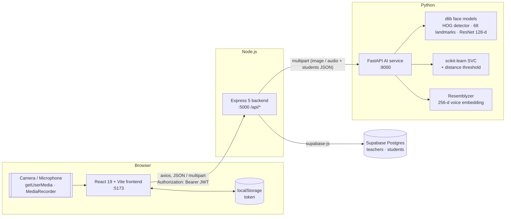
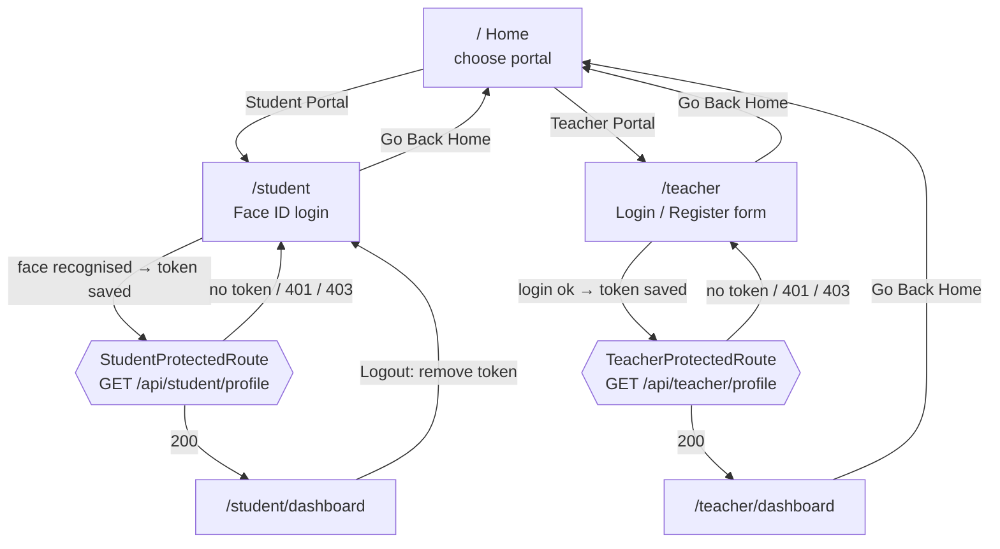
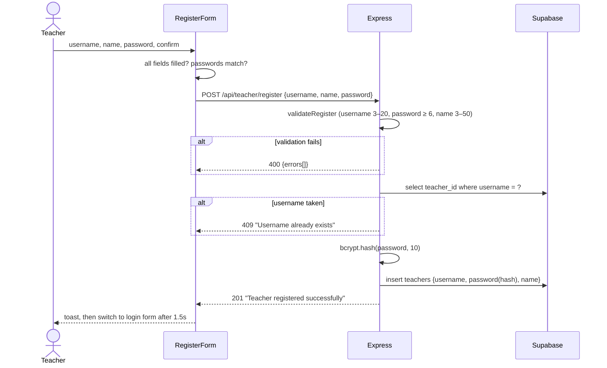
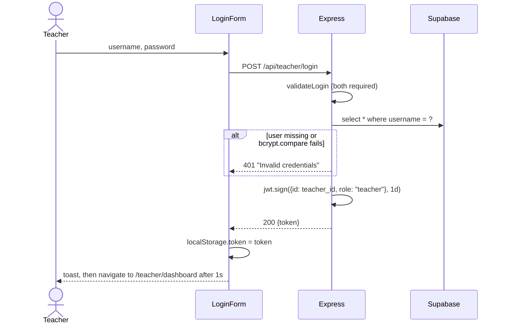
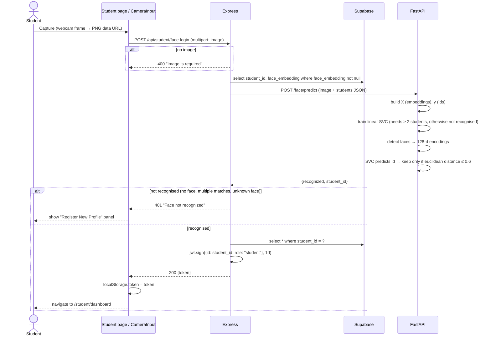
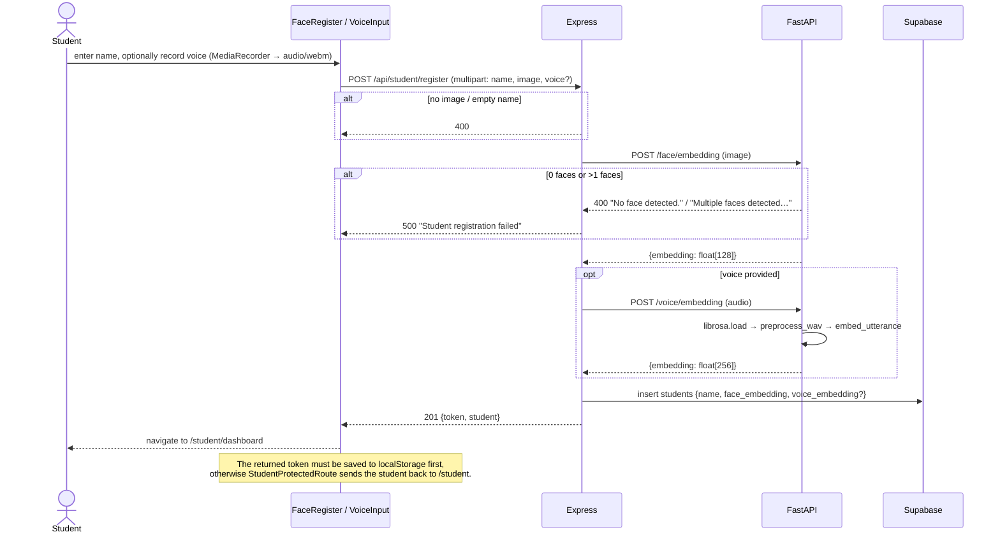
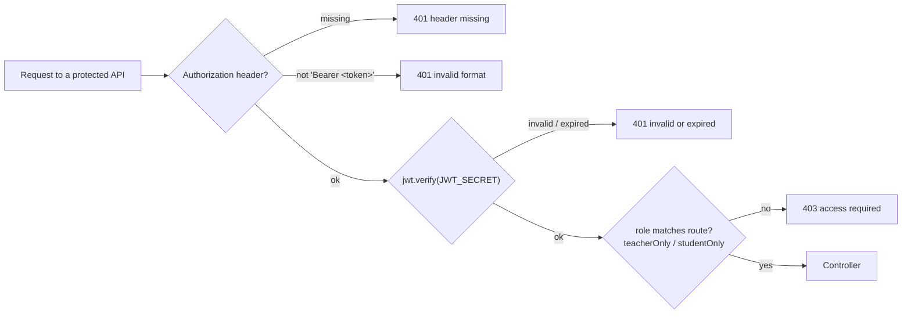

# SnapAttend

SnapAttend is an attendance app built around face recognition. Students log in with their face through the camera, with optional voice enrolment. Teachers log in with a username and password. The attendance-marking system itself isn't built yet; this README covers the authentication and enrolment flows that exist today.

---

## 1. System architecture



**Responsibilities**

| Layer | Owns | Does **not** own |
|---|---|---|
| Frontend | UI, camera/mic capture, storing the JWT, route guards | Any recognition logic |
| Backend | Auth (bcrypt, JWT), validation, role checks, all DB access, orchestrating AI calls | ML models |
| AI service | Face detection, embeddings, matching, voice embeddings. It's **stateless**, so the backend sends it the candidate embeddings on every request | Database access |
| Supabase | Persistent storage for teachers and students (including embeddings) | — |

---

## 2. Tech stack

| Part | Stack |
|---|---|
| `frontend/` | React 19, Vite 8, React Router 7, Tailwind CSS 4, MUI icons, axios, react-hot-toast |
| `backend/` | Node.js (ES modules), Express 5, supabase-js, bcryptjs, jsonwebtoken, express-validator, multer (memory storage), axios |
| `ai-service/` | Python 3.13, FastAPI, uvicorn, dlib + face_recognition_models, scikit-learn, NumPy, Pillow, librosa, resemblyzer |
| Database | Supabase (Postgres) |

---

## 3. Project structure

```
SnapAttend/
├── frontend/
│   └── src/
│       ├── api/                 api.js (axios + JWT interceptor), studentApi.js, teacherApi.js
│       ├── routes/              index.jsx, StudentProtectedRoute.jsx, TeacherProtectedRoute.jsx
│       ├── pages/               Home, Student, StudentDashboard, Teacher, TeacherDashboard
│       └── components/          CameraInput, FaceRegister, VoiceInput, LoginForm, RegisterForm,
│                                PortalCard, Header, DashboardHeader, Card, Input, Button
├── backend/
│   └── src/
│       ├── server.js / app.js
│       ├── routes/              teacherRoutes.js, studentRoutes.js
│       ├── controllers/         teacherController.js, studentController.js
│       ├── services/            teacherService.js, studentService.js (Supabase), aiService.js (HTTP → AI)
│       ├── middleware/          authMiddleware, roleMiddleware, validationMiddleware, uploadMiddleware
│       ├── utils/               jwt.js, password.js
│       └── config/supabase.js
└── ai-service/
    ├── main.py                  FastAPI app, /health
    ├── api/                     face_routes.py, voice_routes.py
    ├── pipelines/               face_pipeline.py, voice_pipeline.py
    └── services/                student_service.py
```

---

## 4. Frontend routes



| Path | Component | Guard | Notes |
|---|---|---|---|
| `/` | `Home` | – | Two portal cards |
| `/student` | `Student` | – | If a valid student token exists, it redirects to the dashboard |
| `/student/dashboard` | `StudentDashboard` | `StudentProtectedRoute` | Placeholder page plus Logout |
| `/teacher` | `Teacher` | – | Toggles between `LoginForm` and `RegisterForm`; redirects if a valid teacher token exists |
| `/teacher/dashboard` | `TeacherDashboard` | `TeacherProtectedRoute` | Placeholder page |

The route guards and "already logged in" redirects all validate the token by calling the matching `/profile` endpoint. If that call fails, the token is removed from `localStorage`.

---

## 5. User flows

### 5.1 Teacher registration



### 5.2 Teacher login



### 5.3 Student face login



### 5.4 Student registration (face + optional voice)

This flow is reached from 5.3 when a face isn't recognised.



### 5.5 Session and route protection



- Tokens are HS256 JWTs with `{ id, role }` that expire after **1 day**.
- The frontend attaches the token automatically through an axios request interceptor (`frontend/src/api/api.js`).
- Teachers and students share the single `localStorage` key `token`.

---

## 6. API reference

### Backend (Express, `http://localhost:5000/api`)

| Method | Endpoint | Auth | Body | Success | Errors |
|---|---|---|---|---|---|
| POST | `/teacher/register` | – | JSON `{username, password, name}` | 201 | 400 validation, 409 duplicate, 500 |
| POST | `/teacher/login` | – | JSON `{username, password}` | 200 `{token}` | 400, 401, 500 |
| GET | `/teacher/profile` | Bearer (teacher) | – | 200 `{user}` (decoded JWT) | 401, 403 |
| POST | `/student/face-login` | – | multipart `image` | 200 `{token}` | 400, 401, 404, 500 |
| POST | `/student/register` | – | multipart `name`, `image`, `voice?` | 201 `{token, student}` | 400, 500 |
| GET | `/student/profile` | Bearer (student) | – | 200 `{student}` | 401, 403, 404, 500 |

### AI service (FastAPI, `http://localhost:8000`, interactive docs at `/docs`)

| Method | Endpoint | Input | Output |
|---|---|---|---|
| GET | `/health` | – | `{success, message}` |
| POST | `/face/embedding` | multipart `image` | `{success, embedding[128]}`; 400 no face or multiple faces |
| POST | `/face/predict` | multipart `image`, `students` (JSON `[{student_id, face_embedding}]`) | `{recognized, student_id}`; 400 invalid JSON |
| POST | `/voice/embedding` | multipart `audio` | `{success, embedding[256]}`; 400 unreadable audio |

---

## 7. Recognition pipelines

**Face (`ai-service/pipelines/face_pipeline.py`)**

1. The dlib HOG frontal face detector runs with 1× upsampling.
2. A 68-point landmark predictor aligns each face.
3. The dlib ResNet model turns each face into a **128-d embedding**.
4. Matching trains a linear `SVC` on the stored embeddings (one per student) and predicts a student id. The match is accepted only if the euclidean distance to that student's stored embedding is **≤ 0.6**.

**Voice (`ai-service/pipelines/voice_pipeline.py`)**

1. `librosa.load` resamples the audio to 16 kHz.
2. Resemblyzer's `preprocess_wav` and `VoiceEncoder.embed_utterance` produce a **256-d embedding**.
3. `identify_speaker`, `process_voice` and `process_bulk_audio` do cosine-similarity matching (threshold 0.65). They're implemented but not wired to any endpoint yet; they're intended for attendance.

---

## 8. Data model (Supabase)

| Table | Columns |
|---|---|
| `teachers` | `teacher_id` (PK), `username` (unique), `password` (bcrypt hash), `name` |
| `students` | `student_id` (PK), `name`, `face_embedding` (float[128]), `voice_embedding` (float[256], nullable) |

---

## 9. Running locally

**Prerequisites:** Node.js 20+, Python 3.13, and a Supabase project containing the tables above.

```bash
# 1. AI service (port 8000)
cd ai-service
python -m venv venv
venv\Scripts\activate          # macOS/Linux: source venv/bin/activate
pip install -r requirements.txt
python main.py
```

```bash
# 2. Backend (port 5000)
cd backend
npm install
npm run dev
```

```bash
# 3. Frontend (port 5173)
cd frontend
npm install
npm run dev
```

`backend/.env`:

```
PORT=5000
SUPABASE_URL=...
SUPABASE_ANON_KEY=...
JWT_SECRET=...
```

The backend calls the AI service at `http://localhost:8000`, and the frontend calls the backend at `http://localhost:5000/api`. Both URLs are hard-coded in `backend/src/services/aiService.js` and `frontend/src/api/api.js`.

---

## 10. Current status

| Area | Status |
|---|---|
| Teacher register / login / protected dashboard | ✅ Working (verified via API tests) |
| Student face login | ✅ Backend + AI working. ⚠️ Needs **≥ 2 registered students** before anyone can be recognised |
| Student registration (face) | ✅ Backend + AI working |
| Student registration (voice) | ⚠️ Browser records WebM, which `librosa.load` can't decode from memory, so registrations with voice fail |
| Frontend build | ❌ `VoiceInput` imports `./Button` (should be `../Button`) |
| Teacher / student dashboards | 🚧 Placeholders |
| Attendance marking (face / voice) | 🚧 Not started (pipelines partly present in the AI service) |

**Known issues found during testing**

- Face login returns the same 401 for *no face*, *multiple faces* and *unknown face*, so the UI offers registration even when the capture was bad.
- Registering with a no-face or multi-face photo returns a generic 500. The AI service's clear 400 message is lost.
- Nothing stops the same face from being registered twice.
- A non-image upload returns 500 instead of 400.
- Malformed JSON and unknown routes return Express's HTML error page, which includes server file paths.
- The frontend has 11 ESLint errors (unused variables, `setState` inside effects, `CameraInput` effect ordering).
- There are no automated tests yet.
